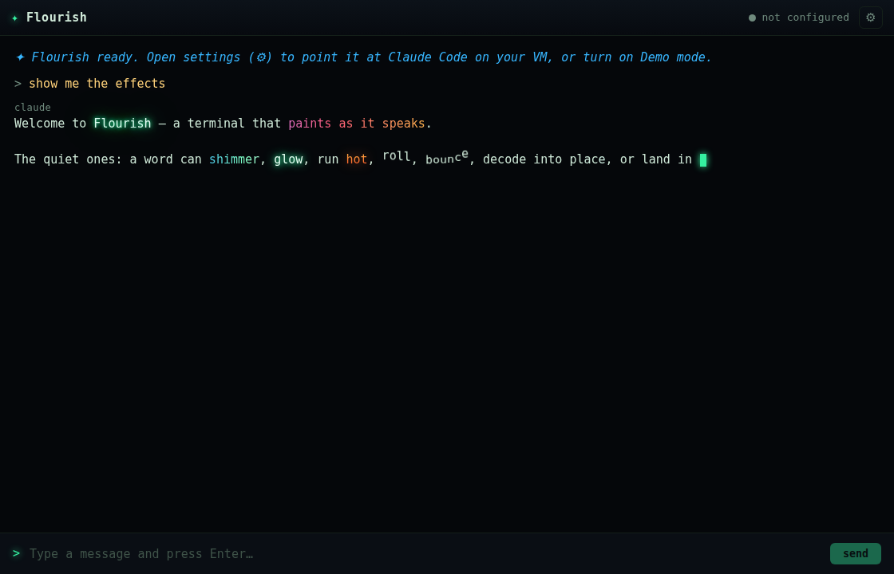

# Flourish

A terminal that **drives Claude Code and paints the visual flourishes the model
directs inline** — its normal working replies arrive lit up.

**It is a web app.** It runs on this VM under systemd and you open it in a
browser:

> **http://100.76.34.62/flourish/**

Your Anthropic auth is whatever `claude` already has on this box. Nothing is
installed on Windows, and no credentials live in the app.



## How it works

```
Browser (Windows) ──HTTP/NDJSON──▶ server.js on the VM
  paints every pixel                     │ spawn()
  on your GPU                            ▼
      ▲                     claude -p --output-format stream-json
      └──── text deltas + tool events ───┘  → typewriter + flourishes
```

Per message, the server spawns (roughly):

```
claude -p '<your message>' \
  --output-format stream-json --verbose --include-partial-messages \
  --append-system-prompt '<flourish protocol>' \
  --resume <session-id> --permission-mode bypassPermissions
```

- **`--resume <session-id>`** keeps the conversation going — context lives in the
  Claude Code session on the VM, so the app only ever sends your latest message.
- **`--append-system-prompt`** teaches Claude Code the flourish vocabulary so its
  normal working replies carry the effect markers.
- **`--permission-mode bypassPermissions`** (the "bypass / dangerous" toggle)
  lets Claude Code run tools without prompting. Turn it off in settings to be
  asked-per-tool instead (headless, so an un-approved tool just errors).
- **stdin is closed** (`stdio: ['ignore', …]`), or Claude Code waits 3 seconds
  for input that never comes.

Events stream back as **one NDJSON line per event, on the POST response itself**
— not EventSource, which is GET-only, and a prompt doesn't belong in a URL.

Tool calls (Read, Bash, Edit, …) show up as dim `⚙ Tool` lines that flip to
`✓ Tool` when they finish, and a spark fires each time one starts.

### The legacy Electron path

A packaged Windows `.exe` also exists, and it reaches the VM over **SSH** (via
`ssh2`) instead of HTTP. It wraps its command in
`bash -lc "cd <project> && … < /dev/null"` — `bash -lc` to get `claude` on `PATH`
over a non-login SSH exec. See [Electron (legacy)](#two-ways-to-run-it) for why
you probably don't want it.

⚠️ **The two transports build that command with two different functions**, both in
`src/bridge.js`: `buildArgs()` (an argv array, for `spawn` — web) and
`buildInner()` (a shell string, `shq()`-quoted — SSH). They are *not* shared;
one can't be, because quoting for a shell would embed literal quotes into
`spawn`'s arguments. **They must teach the model the same vocabulary and they
drift the moment you touch one and not the other** — a flag added to only
`buildArgs()` is a flag the `.exe` silently never passes. Change both.

## The flourish protocol

50 effects. **Point effects** fire once at the caret; **text spans** wrap text
and must be closed; **consuming spans** destroy the text they wrap.

| Point effect | Reads as |
|---|---|
| `{{fx:spark}}` | starting a step, a small win |
| `{{fx:ripple}}` | a quiet beat, a realisation |
| `{{fx:pulse}}` | emphasis (screen flash) |
| `{{fx:embers}}` | work warming up |
| `{{fx:meteor}}` | a wide sweep or search |
| `{{fx:beam}}` | reading, checking, going through |
| `{{fx:sonar}}` | probing, testing, looking for something |
| `{{fx:matrix}}` | digging into code |
| `{{fx:swarm}}` | many things at once, parallel work |
| `{{fx:constellation}}` | connecting the pieces, seeing the pattern |
| `{{fx:aurora}}` | ambient, calm, a lull |
| `{{fx:bloom}}` | something growing, opening out |
| `{{fx:rain}}` | steady, a lot of small things, a downbeat |
| `{{fx:frost}}` | cold, stopping, a freeze |
| `{{fx:warp}}` | speed, a big jump |
| `{{fx:vortex}}` | converging on an answer |
| `{{fx:implode}}` | narrowing down, focusing |
| `{{fx:confetti}}` | a real success |
| `{{fx:fireworks}}` | a bigger success |
| `{{fx:lightning}}` | a sudden insight, a hard truth |
| `{{fx:nova}}` | the biggest moments only |
| `{{fx:shatter}}` | something broke hard |
| `{{fx:glitch}}` | something broken or corrupt |
| `{{fx:shake}}` | a failure |
| `{{fx:scanlines}}` | retro, terminal, low-level |
| `{{fx:static}}` | signal lost, garbage |
| `{{fx:vhs}}` | degraded, old, unreliable |
| `{{fx:grid}}` | synthwave, going somewhere |
| `{{fx:circuit}}` | wiring, how it's connected |
| `{{fx:tracer}}` | paths, routing, following a thread |
| `{{fx:apophenia}}` | a conclusion reached badly — confident, wrong |
| `{{fx:dilate}}` | *paints nothing* — the terminal holds still a beat |

| Text span | Reads as |
|---|---|
| `{{fx:glow}}…{{/fx:glow}}` | a key result |
| `{{fx:shimmer}}…{{/fx:shimmer}}` | polished, elegant |
| `{{fx:chrome}}…{{/fx:chrome}}` | hard, engineered, machined |
| `{{fx:rainbow}}…{{/fx:rainbow}}` | playful, celebratory |
| `{{fx:sparkle}}…{{/fx:sparkle}}` | delightful, a little magic |
| `{{fx:fire}}…{{/fx:fire}}` | hot, urgent |
| `{{fx:neon}}…{{/fx:neon}}` | a name or label |
| `{{fx:flicker}}…{{/fx:flicker}}` | unstable, failing |
| `{{fx:corrupt}}…{{/fx:corrupt}}` | broken data, garbage |
| `{{fx:ghost}}…{{/fx:ghost}}` | an aside, a maybe |
| `{{fx:wave}}…{{/fx:wave}}` | lilting, rolling |
| `{{fx:bounce}}…{{/fx:bounce}}` | upbeat |
| `{{fx:stamp}}…{{/fx:stamp}}` | a verdict, a decision, final |
| `{{fx:scramble}}…{{/fx:scramble}}` | text that decodes into place |
| `{{fx:hexdump}}…{{/fx:hexdump}}` | raw bytes, low-level, machine |
| `{{fx:hologram}}…{{/fx:hologram}}` | virtual, projected, not real |
| `{{fx:redact}}…{{/fx:redact}}` | a bar slides away — a reveal |
| `{{fx:twin}}…{{/fx:twin}}` | two copies, drifting out of sync |
| `{{fx:overwrite}}…{{/fx:overwrite}}` | a buffer with two writers |
| `{{fx:palimpsest old text}}…{{/fx:palimpsest}}` | what it said before, underneath |
| `{{fx:rot}}…{{/fx:rot}}` | **lies** — decays toward lookalikes |
| `{{fx:confabulate}}…{{/fx:confabulate}}` | **lies** — words turn over behind you |
| `{{fx:intrusive a word}}…{{/fx:intrusive}}` | **lies** — a word that was never said |
| `{{fx:color #ff0066}}…{{/fx:color}}` | any specific colour |

### Consuming spans

`{{fx:burn}}` and `{{fx:cascade}}` **destroy the text they wrap** — the
characters catch, burn down and are gone, and the reader can't get them back.
They're the only effects that can cost the reader something, so the system
prompt scopes them hard: use them where the disappearing *is* the point (a
deleted file, a dead idea, a revoked option), never as emphasis on a sentence
someone needs to read. `npm test` asserts that guardrail is still in the prompt,
because the engine will happily eat a load-bearing sentence and only that
paragraph stops it.

Both take a **wind** — `left`/`right` and `still`/`breeze`/`gale`, in either
order: `{{fx:burn left gale}}`. Fire seeds on one random character and spreads
outward; the wind makes the spread asymmetric (downwind races, upwind creeps),
and that asymmetry is what you can actually watch travel. The propagation model
is pure arithmetic in `flourish.js` (`planBurn`) so it's unit-tested rather than
buried in a rAF loop.

These are also the only effects that **bridge the two layers**: everything else
either styles DOM or paints canvas, never both. `src/textfx.js` animates real
characters *and* throws real particles off them — embers from the flame front,
ash from consumed characters, falling glyphs for `cascade` — all from the same
engine that draws a nova.

### Unreliable spans

`{{fx:rot}}`, `{{fx:confabulate}}` and `{{fx:intrusive}}` **change what the text
says** after the reader has read it. Everything else in the vocabulary is
honest — a glowing command is still the command, and even `corrupt` and `glitch`
announce their own unreliability so loudly that the reader knows to discount
them. A thing that says *"I am broken"* is trustworthy. These three don't say
anything.

That's the register they exist for: a record that changed behind you, a memory
that doesn't match, a machine being unreliable about itself. They are not
emphasis and not decoration.

They're also the only place in the app where **the screen stops being evidence
of what the model said** — which matters more here than it would in a toy,
because Flourish renders real working output. So the aiming rule is not left to
the prompt. `Flourish.mutableMask()` decides, per character, what is plainly
English prose; `textfx.js` refuses to touch anything else. Paths, commands,
numbers, flags, backticked code — and, because `rm` and `git` are perfectly good
words until you see the `-rf` next to them, **the words around them too**:
contamination spreads from a hard token until the end of the sentence. Bare
numbers freeze themselves without spreading, or one year would freeze every
paragraph containing it.

A careless span therefore degrades to *doing nothing* rather than to lying about
a command. `npm test` asserts both that the mask is right and that textfx
actually calls it — a wiring mistake there is invisible on screen, because a
guard that never fires looks exactly like a guard that passed. `npm run fx-shots`
proves it against real pixels: it rots `git reset --hard origin/main` for nine
seconds and fails if a single byte moved.

`{{fx:dilate}}` belongs to the same family and paints nothing at all — it stalls
the typewriter for a beat and carries on. It's the one point effect with no
engine case, because the renderer intercepts it (`RENDERER_EFFECTS`); in a
terminal that never stops painting, stopping is the only thing left that can
unsettle anyone.

Point effects take an optional **palette** (`mint` `ice` `gold` `ember` `violet`
`rose` `mono`) and **size** (`sm` `md` `lg` `xl`), in either order —
`{{fx:spark gold}}`, `{{fx:nova sm}}`, `{{fx:swarm violet lg}}`. An unknown word
is ignored rather than fatal, so a typo costs the shading, not the effect.

The vocabulary is defined once in `src/flourish.js` and everything else is
checked against it: `npm test` fails if a name has no engine case, no CSS rule,
or no mention in the system prompt. That last one matters — an effect the prompt
never teaches is one the model will never fire. The same goes for the arg
grammar (a palette the parser accepts but the engine lacks would silently paint
the default) and for the tool map below (which the prompt can't cover, because
the model never writes it).

The parser is pure and streaming-safe (it handles a directive split across two
network chunks), so it's unit-tested without a browser.

`wave`, `bounce`, `scramble`, `stamp`, `corrupt`, `sparkle`, `hexdump`, `twin`,
`overwrite`, `rot`, `confabulate`, `intrusive`, `burn` and `cascade` render one
`<i>` per character (`PER_CHAR_SPANS`) so they can stagger or be driven
individually; everything else is a single styled span.

`burn`, `cascade`, `rot`, `confabulate`, `intrusive` and `overwrite`
(`SCRIPTED_SPANS`) are driven from `textfx.js` when their **closing** directive
arrives, not as characters stream in — they all need the span to be complete.
Fire can't spread through a word that's still being typed, a word can't be
swapped before it exists, and `overwrite` can't ramp a pull-back across *n*
characters until it knows what *n* is.

### Variety is mostly free

The system prompt is prepended to **every** request, so the vocabulary is the one
part of Flourish with a running token cost. Most of the variety is therefore
bought somewhere cheaper:

- **Each effect has 3–4 structural variants**, picked at random. `spark` is an
  even radial burst, or an upward fan, or a crackling double-pop, or a ring that
  snaps outward; `fireworks` is a double shell, a drooping willow, or a ring
  around a dense heart. Same directive, different picture, no prompt cost.
- **The app fires its own effects** from things the model never says: see below.
- **The auto-highlight layer** styles what the model didn't mark up at all.

### What the app paints by itself

None of this costs the model a token, and it keeps painting even in a reply that
fires no directives at all.

- **Every tool call paints its own shape** — `Read`/`Grep` sweep a beam, `Bash`
  rains glyphs, `Edit`/`Write` throw sparks, `WebSearch` throws meteors, `Task`
  releases a swarm. Tool *completion* puffs green (it used to paint nothing).
- **`src/autofx.js` highlights form, not meaning** — inline `` `code` ``,
  `**bold**` and bare numbers style themselves. This is why the system prompt
  tells the model *not* to wrap code or numbers in spans: the terminal already
  does it, and doing it with a span is what breaks copy/paste.
- **Punctuation micro-sparks** — `!` and `?` throw a small burst as they're
  revealed (throttled, or an excited reply strobes).
- **The connection paints itself** — a ripple on connect, frost on disconnect, a
  glitch on error. The model can't narrate any of that: when it matters, it's
  unreachable.
- **Ambient idle** — after ~45s of nothing, a slow aurora/swarm/constellation.

## Flourishes while you type

The prompt box paints too, independent of the model. Three layers stack:

- **Heat** — typing fast builds heat (it decays when you pause), escalating the
  sparks through five tiers — cool green flecks → warm → hot → blaze → a
  white-hot **inferno** that makes the input row itself breathe. Sending spends
  it: a cold prompt launches with a spark, an incandescent one with a nova.
- **Key class** — *what* you typed matters, not just how fast. Space puffs (and
  pays out more for a longer word), `.,;:` tick, digits fleck cyan, capitals
  land bigger, `!` sparks, `?` ripples, delete is a cold puff that cools the
  streak, and pasted text gets a constellation — it didn't come from your hands,
  so it shouldn't look like it did.
- **Streak** — an unbroken run pays out at 25, 60, 120 and 200 keys, so a long
  fluent sentence builds to something. Arrow keys leave a small wake, and a
  written-but-unsent message breathes rather than sitting inert.

Finding the caret inside an `<input>` is the fiddly part (no Range API for form
fields), so `src/inputfx.js` measures the text before the caret with the input's
own computed font on a scratch canvas.

## Requirements

- **On the VM:** Node.js 18+ and Claude Code (`claude`) installed and
  authenticated. `server.js` uses only Node built-ins, so the web app needs no
  `npm install` at all.
- **On Windows:** a browser. Nothing else.
- **To develop, or to build the legacy `.exe`:** npm — `ssh2` (pure-JS) is the
  only runtime dep, and it is used *only* by the Electron/SSH path; Electron
  itself is a devDependency.

```bash
npm install
```

## Two ways to run it

**Web (default — no download, no exe, no AV).** Flourish runs on the VM and you
open it in a browser on Windows:

> **http://100.76.34.62/flourish/**

`server.js` spawns `claude` as a local child process and serves `src/`. There is
no SSH, no key, and nothing installed on Windows.

**This does not move rendering to the VM.** Your browser executes the JS and
paints every pixel on *your* GPU, at *your* refresh rate — Chrome and Electron
are the same Chromium (same Skia, same compositor, same anti-aliasing). The VM
ships ~200KB of text. (X-forwarding/VNC *would* render on the VM and look
terrible. This is the opposite of that.)

For a window that looks like an app rather than a tab — chromeless, pinnable to
the taskbar:

```
chrome.exe --app=http://100.76.34.62/flourish/
msedge.exe --app=http://100.76.34.62/flourish/
```

**Electron (legacy).** The packaged `.exe` still works and still SSHes in. It's
kept for the case where Flourish has to run somewhere that isn't this VM. Be
aware that it is an unsigned binary that reads a private key and executes remote
commands with permissions bypassed — Windows Defender flags it, and Defender is
not wrong. Clearing that properly needs a code-signing certificate.

## Start / Stop

The web app runs under systemd and starts at boot:

```bash
sudo systemctl status flourish     # is it up?
sudo systemctl restart flourish    # after a server.js / src/ change
sudo journalctl -u flourish -f     # logs (including claude's stderr)
```

`src/` is served straight off the working tree, so **UI changes need no restart
— just reload the page.** Only `server.js` changes need `restart`.

Run it in the foreground instead:

```bash
npm run web        # node server.js on 127.0.0.1:8787
```

The web app needs no connection setup — the server is already where `claude`
lives. **⚙ settings** covers the working directory, model, the bypass toggle,
and **Demo mode** (scripted replies, no `claude` — the effects with nothing
behind them).

The legacy Electron app:

```bash
npm start          # launches the Electron app
```

That one *does* need connection setup: open **⚙ settings**, enter your VM's
host/IP (Tailscale IP works), username, and SSH key (or password), then **Test
connection**. Close the window (or Ctrl-C the launching terminal) to stop.

## The dev loop

**On the web app there isn't one to speak of.** nginx serves `src/` straight off
the working tree, so Claude edits a file and you hit reload. Only `server.js`
changes need `sudo systemctl restart flourish`.

That is the whole reason the web app exists, and the rest of this section is the
archaeology of getting there.

### Live UI (legacy Electron)

A UI change used to cost a **148MB rebuild → download → extract**. That's a bad
trade, because the renderer *is* the app: ~90% of Flourish is effects, CSS and
DOM, and it's **208KB** of that 148MB zip. The rest is Chromium.

So the `.exe` can load its UI **live off the VM** instead of from the copy baked
into it:

1. In **⚙ settings**, set **Live UI URL** to `http://100.76.34.62/flourish/`
   (the VM's Tailscale IP).
2. **Restart Flourish once.** Which document loads is decided when the window is
   created, so this one setting can't apply itself.
3. From then on: **Ctrl-R** reloads the UI, **F12** opens devtools.

Claude edits `src/` on the VM; you hit Ctrl-R. No download, no extract, and it's
the real app — real SSH, real Claude Code, real system prompt.

`FLOURISH_DEV_URL=http://…/flourish/ npm start` does the same without touching
saved settings.

**What this does and doesn't move.** Only the UI is served from the VM. The SSH
bridge, the private-key handling and the system prompt stay in the packaged main
process — a live UI can never widen what the app is able to do. nginx serves
`/flourish/` `no-store` behind `snippets/tailnet-only.conf`: reachable from the
tailnet/LAN, **403 from `127.0.0.1`**, which is where the Cloudflare tunnel
connects from. A machine that can serve JavaScript to your desktop app is not a
public surface.

**What still needs a rebuild:** `main.js`, `preload.js`, `bridge.js` and
`prompt.js` are main-process code. If Claude changes the effect vocabulary in
`prompt.js`, the running `.exe` keeps the vocabulary it was built with — which
is exactly the drift the build stamp exists to expose.

### Which code am I running?

The titlebar says so:

| Stamp | Meaning |
|---|---|
| `e6d2907` | packaged UI, built from that commit |
| `e6d2907+` | `+` = uncommitted changes were in the tree when it was stamped |
| `ui a1b2c3d · app e6d2907 · live` | UI served live off the VM — **two different commits**. `ui` is what you're looking at; `app` is the shell that owns the SSH bridge and the system prompt. |

Hover it for the full detail. `tools/stamp.js` writes this from git at
`prestart`/`presmoke`/`prescreenshot`/`prepackage`, into `src/build-info.js` +
`build-info.json` (generated, never committed).

This exists because the `.exe` embeds a *copy* of `src/` and `prompt.js`, so the
repo and the running code drift silently — a session once "verified" 40 effects
against a build whose `prompt.js` predated the other 10. If you're serving the
UI live, **run `npm run stamp` after edits** so the stamp keeps up.

## Test

Pure-logic unit tests (parser, auto-highlighter, stream translator, command
builder, and the vocabulary-vs-engine/CSS/prompt/tool-map seams):

```bash
npm test           # node --test — 88 tests, no browser/VM needed
```

**These do not touch the renderer.** They passed 88/88 while the app rendered
exactly one word of every reply (see *Smoke test* below). Green here means the
parser and bridge are sound; it says nothing about whether the app boots.

### Smoke test — does the app actually run?

Drives the **real renderer** over the **real preload bridge** with the **real
demo stream**, and fails on: any uncaught renderer error, raw `{{fx:}}`
directives leaking as text, a reply that doesn't land whole, or an input that
never re-enables.

```bash
npm run smoke        # the files in this checkout, over Electron's IPC bridge
npm run smoke:web    # NO preload — src/webapi.js against the live server, i.e.
                     # exactly what Chrome on Windows does
```

`smoke:web` is the one that matters for the web app, and it earns its keep: it
immediately caught `/flourish/flourish.js` 404ing, because the server's
prefix-stripping regex `/^\/flourish/` also matched the *start* of
`flourish.js` and rewrote it to `.js`. Every other file loaded fine. The
Electron path can't see that bug at all.

It puts the server in demo mode for the run and restores your setting after.

The `--url` form matters once you're using the dev loop: "works in the checkout"
and "works in Jim's window" become different claims, and only the second is the
one he experiences.

`prepackage:win` runs this, so **a broken build can't be packaged**.

### Screenshot — a viewing tool, not a test

```bash
npm run screenshot           # needs xvfb; writes ./flourish-screenshot.png
```

It renders the real UI to a PNG and **exits 0 regardless of what's in the PNG**.
It photographed a fatally broken app twice without complaint. Use it to look at
things; use `npm run smoke` to know they work.

Visual proof of every effect — fires each one in the real renderer and captures
it mid-flight to `assets/fx/<name>.png`:

```bash
npm run fx-shots             # needs xvfb; 48 frames
```

Particle budget — fills the engine to each rung and counts real frames:

```bash
npm run fx-bench             # needs xvfb
```

The SSH bridge was also verified end-to-end against real Claude Code over a real
SSH connection (text streaming, session-id capture, tool events, bypass mode)
using the shipping `src/bridge.js` + `src/ccstream.js`.

## Build the Windows program

Cross-packages a Windows x64 build from Linux (no Wine):

```bash
npm run package:win
(cd dist && zip -r Flourish-win32-x64.zip Flourish-win32-x64)
```

Output: `dist/Flourish-win32-x64/Flourish.exe` — copy the folder/zip to your
Windows 11 box and double-click. No install step.

To pull it onto the Windows box, nginx serves the zip **over the tailnet only**
(basic-auth, SimJim Admin — see `FENCE.md`):

```
http://100.76.34.62/dl/Flourish-win32-x64.zip
```

Or over SSH: `scp aiops@100.76.34.62:/var/www/simjim/apps/flourish/dist/Flourish-win32-x64.zip .`

It is deliberately **not** reachable from simjim.net or dev.simjim.net. It's a
142MB unsigned `.exe`; Windows SmartScreen will warn on first run either way
("More info" → "Run anyway").

Sanity-check a fresh package before shipping it — `--prune=true` has to keep
every `src/` file the renderer loads, and a missing one is a blank window:

```bash
npx asar list dist/Flourish-win32-x64/resources/app.asar | grep src/
```

## Architecture

Two hosts, one renderer. `src/` below the line doesn't know or care which one it
is running under.

```
── web (default) ────────────────────────────────────────────────────────
server.js        Node built-ins only: serves src/, spawns claude locally,
                 streams NDJSON events on the POST response. Demo mode too.
src/webapi.js    window.flourishAPI over fetch — the browser's stand-in for
                 preload.js. NO privileged surface; this is what smoke:web runs.

── electron (legacy) ────────────────────────────────────────────────────
main.js          Electron main: SSH connection, runs claude, parses stream-json,
                 relays text deltas + tool events over IPC. Demo mode too.
preload.js       contextBridge: the narrow window.flourishAPI surface.
src/bridge.js    pure: ssh2 connect config + buildArgs() — the claude invocation,
                 shared with server.js — plus the SSH command wrapper.

── shared ───────────────────────────────────────────────────────────────
src/ccstream.js  pure: Claude Code stream-json → app events (+ line buffer).
src/flourish.js  pure: streaming flourish-directive parser + arg grammar (UMD).
src/autofx.js    pure: streaming auto-highlighter for code/bold/numbers (UMD).
src/textfx.js    the scripted spans. The consuming ones (burn/cascade) are the
                 one place the DOM text layer and the canvas particle layer
                 meet; the unreliable ones (rot/confabulate/intrusive) are the
                 one place the text stops being what the model said, and the
                 one place a guard decides what may move.
src/prompt.js    the flourish protocol appended to Claude Code's system prompt.
src/effects.js   canvas particle engine + full-screen effects.
src/inputfx.js   prompt-box typing sparks + the heat model.
src/scroller.js  critically-damped spring that follows the typewriter's moving
                 target (a tween or CSS smooth-scroll can't — the target moves).
src/renderer.js  terminal UI + typewriter that interleaves text and tool events,
                 the tool→effect map, and the app's own ambient/status effects.
src/demo.js      offline scripted responder (no VM needed).
src/build-info.js  generated by tools/stamp.js — never committed.
tools/fx-shots.js  visual verification harness (alternate Electron entry).
tools/fx-bench.js  particle-budget benchmark (alternate Electron entry).
```

## Notes

- **The particle cap is a backstop, not a budget.** `MAX_PARTICLES` is 16000,
  but no effect comes close: the biggest single one is `{{fx:nova xl}}` at
  **1352** particles, and a plain `nova` is 520. Measured on this VM under
  software GL (`npm run fx-bench`, a pessimistic floor — a real GPU does
  better):

  | particles | fps |
  |---|---|
  | 400 | 60 |
  | 1600 | 60 |
  | 4000 | 60 |
  | 8000 | 31 |
  | 16000 | 11–16 |

  So the knee is around **4000**, roughly three simultaneous nova-xl, and the
  cap exists only to stop a pathological pile-up from going worse than ~15fps.
  Raising the cap alone changes nothing visible; if you want more on screen,
  raise the *per-effect* counts and re-run the bench. Ignore the first rung of a
  cold run — window/GL warm-up makes it lie (it once reported 4000 as slower
  than 8000).
- **Particle glow is a cached sprite, not `ctx.shadowBlur`.** Chromium
  rasterizes canvas2d shadows on the CPU per draw call: with `shadowBlur`,
  `{{fx:nova}}`'s 180 glowing particles measured **2 frames in 353ms (~6fps)**,
  so every particle was still bunched at the origin while the effect "played".
  Baking each colour's falloff into a 64px offscreen canvas once and blitting it
  per particle took the same effect to **16 frames in 262ms (~61fps)**. Don't
  reintroduce per-particle shadows.
- **The typewriter drains its whole text backlog per frame.** It used to move
  one chunk into the reveal buffer only once that buffer ran dry, which pinned
  `reveal.length` at ~6 and defeated the adaptive rate — a hard ceiling of ~50
  chars/s regardless of how fast the model streamed (a 630-char reply finished
  painting **9.6s after the stream ended**). Now ~118 chars/s under software GL,
  and it speeds up the further behind it gets.
- **Katakana is not guaranteed to have a glyph.** `matrix` shipped for two
  releases rendering as a screen of notdef boxes on any machine whose monospace
  font lacks half-width kana — this VM's does, and a tofu box at 13px in a dark
  terminal reads as "some glyph" until you actually look at the capture. The
  engine now draws `ｱ` and `U+FFFE` (a permanent noncharacter, so whatever it
  draws *is* this font stack's notdef) to an offscreen canvas and compares
  pixels: identical means no kana, and it falls back to an ASCII/box-drawing
  alphabet. Windows finds a Japanese fallback font and still gets the classic
  look. Don't hard-code a glyph alphabet — go through `glyphAlphabet()`.
- **Consuming characters must not reflow the paragraph.** A burnt-out `<i>` goes
  to `opacity: 0` in place and is never removed or `display:none`d — otherwise
  the text visibly jumps around as it's eaten, which reads as a bug rather than
  as fire.
- **`executeJavaScript` evaluates in the page's global scope.** A bare `const`
  in a harness snippet throws "already declared" the second time it runs, and
  the failure surfaces as "the effect is broken" rather than "the harness is".
  Wrap snippets in an IIFE.
- **`tools/fx-shots.js` shows its window and disables background throttling.**
  A hidden or occluded Electron window throttles `requestAnimationFrame`, so
  particle life stops advancing, effects never expire, and each captured frame
  is a pile-up of the previous few. Its `reset()` must clear *every* array the
  engine animates (`particles` `rings` `bolts` `sheets` `sweeps` `links` `frost`
  `matrix`) — miss one when adding an effect and that effect quietly stacks up
  across every later shot.
- **An effect must be fully formed while it can still be seen.** A particle's
  alpha is `1 - life/max`, so any effect that eases its shape across the whole
  lifetime finishes forming at the moment it's already two-thirds faded.
  `bloom` originally opened over `t*1.5` and photographed as a dim smudge; it
  opens over `t*3.4` now — fully a flower by `t≈0.3`, then holds while it fades.
- **`ssh2` runs in pure-JS crypto mode.** Its optional native bindings
  (`sshcrypto`, `cpu-features`) are removed and `.npmrc` sets `omit=optional`,
  because a Node-ABI `.node` crashes Electron and can't be cross-compiled for
  Windows from Linux. Pure-JS supports ed25519/rsa keys and passwords fine.
- **Host keys** are currently accepted on first use without pinning (fine for a
  Tailscale/LAN VM you control). A future version can add TOFU verification.
- The Linux build can't render the Windows GUI, so final visual confirmation is
  on Windows; `npm run screenshot` verifies the identical renderer under Linux.
